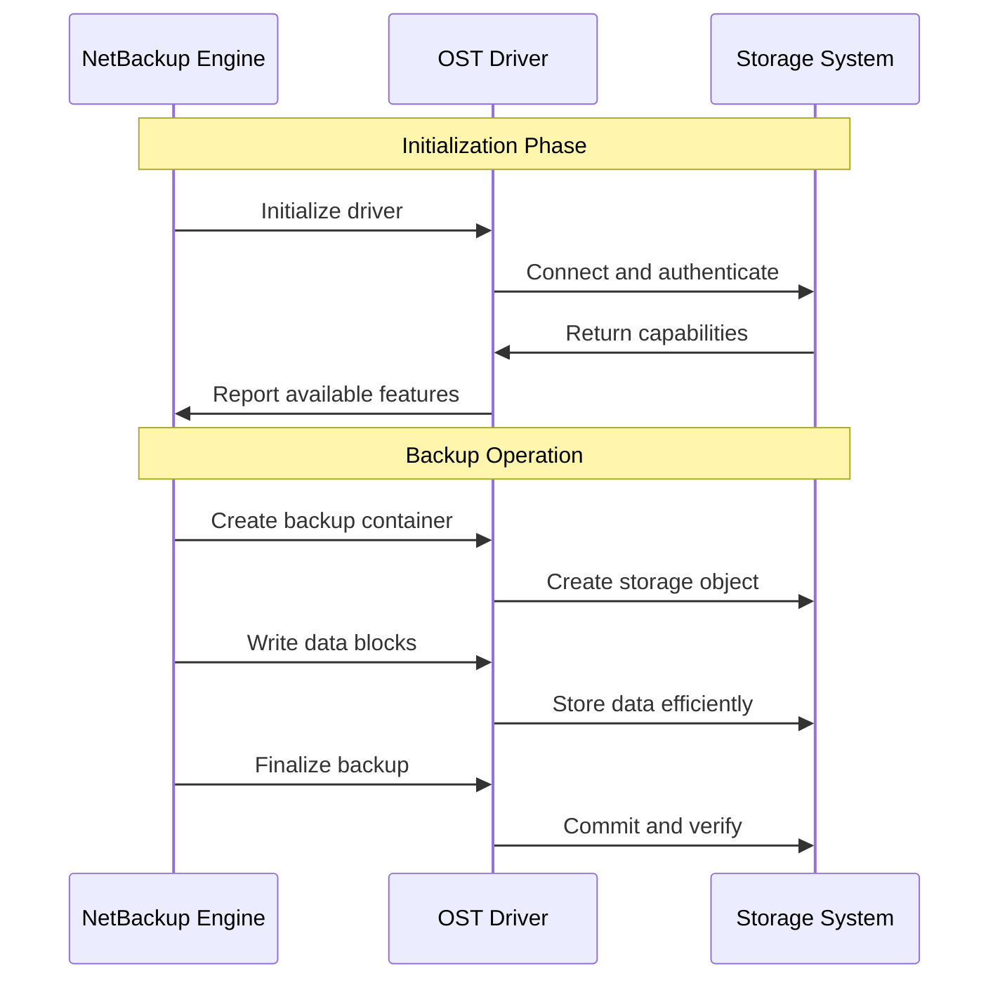
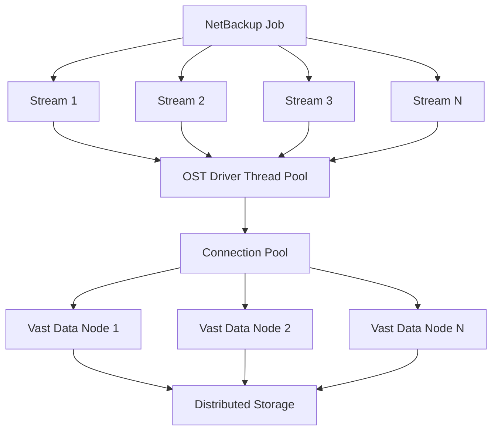
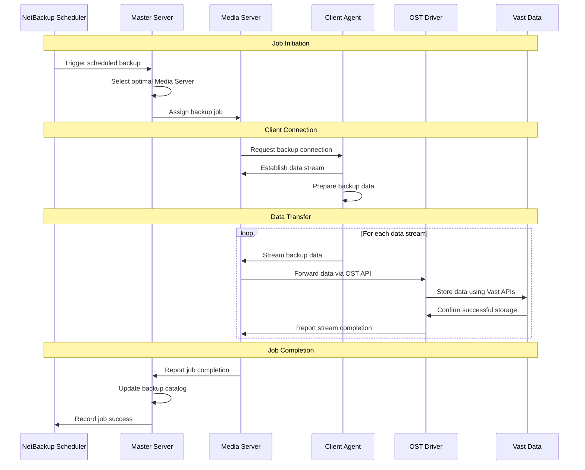

# NetBackup & Vast Data OST Driver
## Technical Implementation Guide

---

## 1. NetBackup Architecture Overview

### Core Components
```
┌─────────────────────────────────────────────────────────────┐
│                    NetBackup Domain                         │
│                                                             │
│  ┌─────────────────┐     ┌─────────────────────────────────┐│
│  │  Master Server  │────▶│         Media Servers           ││
│  │  • Policy Mgmt  │     │  ┌─────────────────────────────┐││
│  │  • Job Schedule │     │  │ Media Server 1              │││
│  │  • Catalog DB   │     │  │ • OST Driver                │││
│  │  • Admin Console│     │  │ • Data Transfer             │││
│  └─────────────────┘     │  │ • Storage Management        │││
│                          │  └─────────────────────────────┘││
│                          │  ┌─────────────────────────────┐││
│                          │  │ Media Server 2              │││
│                          │  │ • OST Driver                │││
│                          │  │ • Data Transfer             │││
│                          │  └─────────────────────────────┘││
│                          └─────────────────────────────────┘│
│                                         │                   │
│  ┌─────────────────────────────────────────────────────────┐│
│  │               Client Agents                             ││
│  │  ┌─────────────┐ ┌─────────────┐ ┌─────────────┐        ││
│  │  │File Servers │ │DB Servers   │ │App Servers  │  ...   ││
│  │  └─────────────┘ └─────────────┘ └─────────────┘        ││
│  └─────────────────────────────────────────────────────────┘│
└─────────────────────────────────────────────────────────────┘
```

### What Each Component Does

**Master Server (Single Instance)**
- Centralized management and control point
- Hosts the NetBackup Administration Console (the UI)
- Manages backup policies, schedules, and retention rules
- Maintains the backup catalog database
- Coordinates job execution across Media Servers
- Handles reporting and monitoring

**Media Servers (Multiple Instances)**
- Dedicated servers that handle actual backup operations
- Execute backup and restore jobs assigned by Master Server
- Stream data from clients to storage systems
- Run OST drivers and other storage connectors
- Handle deduplication, encryption, and compression
- Typically deployed close to storage systems for performance

**Client Agents (Per Protected System)**
- Lightweight software installed on every system being backed up
- Handles file system access and application integration
- Streams data to assigned Media Servers during backup
- Supports various platforms: Windows, Linux, Unix, VMware, etc.
- Application-specific agents for databases, email systems, etc.

---

## 2. Data Sources and Backup Targets

### What NetBackup Protects

**File Systems and Applications**
- Traditional file servers and NAS devices
- Database systems: Oracle, SQL Server, MySQL, PostgreSQL
- Email platforms: Microsoft Exchange, Lotus Notes
- Enterprise applications: SAP, SharePoint, custom applications
- System state and configuration data

**Virtualized Environments**
- VMware vSphere virtual machines
- Microsoft Hyper-V environments  
- Container platforms and Kubernetes
- Virtual desktop infrastructure (VDI)

**Cloud and Hybrid Workloads**
- AWS EC2 instances and services
- Microsoft Azure virtual machines
- Google Cloud Platform resources
- SaaS applications like Office 365

### Backup Configuration Model

**Policy-Based Management**
```
Backup Policy Creation Process:
┌─────────────────┐
│ Define Policy   │ → What data to backup
├─────────────────┤
│ Select Clients  │ → Which machines/applications
├─────────────────┤
│ Set Schedule    │ → When to run backups
├─────────────────┤
│ Choose Storage  │ → Where to store data
├─────────────────┤
│ Set Retention   │ → How long to keep backups
└─────────────────┘
```

**Flexible Targeting Options**
- **Machine-level**: Backup entire servers or workstations
- **Volume-level**: Backup specific disk drives or partitions
- **Directory-level**: Backup specific folders or file types
- **Application-level**: Backup databases, email stores, etc.
- **Mixed approach**: Combine different targeting methods in policies

---

## 3. NetBackup Storage Protocols

### Protocol Landscape
```
NetBackup Media Server
         │
    ┌────┴────────────────────────────────┐
    │                                     │
    ▼            ▼            ▼           ▼
┌─────────┐ ┌─────────┐ ┌─────────┐ ┌─────────┐
│ Native  │ │  NDMP   │ │   OST   │ │ Cloud   │
│Protocol │ │ (NAS)   │ │(Plugins)│ │ APIs    │
└─────────┘ └─────────┘ └─────────┘ └─────────┘
    │           │           │           │
    ▼           ▼           ▼           ▼
┌─────────┐ ┌─────────┐ ┌─────────┐ ┌─────────┐
│NetBackup│ │  NAS    │ │Storage  │ │ Cloud   │
│Appliance│ │Devices  │ │Vendors  │ │Services │
└─────────┘ └─────────┘ └─────────┘ └─────────┘
```

**Native NetBackup Protocol**
- Proprietary high-performance protocol
- Used between NetBackup components
- Optimized for NetBackup appliances and disk pools

**NDMP (Network Data Management Protocol)**
- Industry standard for NAS backup
- Direct communication with storage controllers
- Bypasses file system overhead for better performance

**OST (OpenStorage Technology)**
- Plugin architecture for storage vendor integration
- Enables deep integration with storage features
- Our focus for Vast Data integration

**Cloud Storage Protocols**
- S3, Azure Blob, Google Cloud Storage APIs
- Long-term retention and disaster recovery
- Cost-effective for infrequently accessed data

---

## 4. OST (OpenStorage Technology) Deep Dive

### Why OST Exists
Traditional generic protocols treat all storage the same way. OST allows storage vendors to expose their unique capabilities directly to NetBackup.

### OST vs Generic Protocols

| Feature | Generic Protocol | OST Driver |
|---------|------------------|------------|
| **Integration** | Basic read/write | Native storage features |
| **Performance** | Generic optimization | Storage-specific tuning |
| **Features** | Limited to basic I/O | Dedup, compression, snapshots |
| **Management** | Separate tools | Unified NetBackup interface |
| **Scalability** | Protocol limitations | Storage-native scaling |

### OST Driver Architecture


### OST Driver Responsibilities

**API Translation**
- Convert NetBackup operations to storage-specific APIs
- Handle differences in data models and semantics
- Manage protocol-specific optimizations

**Connection Management**
- Maintain efficient connections to storage systems
- Handle authentication and security
- Implement connection pooling and retry logic

**Performance Optimization**
- Support multiple concurrent data streams
- Implement efficient buffering strategies
- Provide flow control and backpressure handling

**Feature Mapping**
- Expose storage capabilities to NetBackup
- Map storage features to NetBackup concepts
- Handle feature compatibility and fallbacks

---

## 5. Vast Data Platform Overview

### Vast Data Architecture
```
┌─────────────────────────────────────────────────────────────┐
│                 Vast Data Cluster                           │
│                                                             │
│  ┌─────────────┐  ┌─────────────┐  ┌─────────────┐          │ 
│  │    Node 1   │  │    Node 2   │  │    Node N   │          │
│  │ ┌─────────┐ │  │ ┌─────────┐ │  │ ┌─────────┐ │          │
│  │ │Compute  │ │  │ │Compute  │ │  │ │Compute  │ │          │
│  │ │Engine   │ │  │ │Engine   │ │  │ │Engine   │ │          │
│  │ └─────────┘ │  │ └─────────┘ │  │ └─────────┘ │          │
│  │ ┌─────────┐ │  │ ┌─────────┐ │  │ ┌─────────┐ │          │
│  │ │Storage  │ │  │ │Storage  │ │  │ │Storage  │ │          │
│  │ │Media    │ │  │ │Media    │ │  │ │Media    │ │          │
│  │ └─────────┘ │  │ └─────────┘ │  │ └─────────┘ │          │
│  └─────────────┘  └─────────────┘  └─────────────┘          │
│                             │                               │
│  ┌─────────────────────────────────────────────────────────┐│
│  │            Global Namespace & Metadata Layer            ││
│  └─────────────────────────────────────────────────────────┘│
└─────────────────────────────────────────────────────────────┘
                              │
                    ┌─────────────────┐
                    │   Client Access │
                    │ NFS │SMB │ APIs │
                    └─────────────────┘
```

### Deployment Models

**On-Premises Deployment**
- Vast Data appliances in customer data centers
- Direct control over hardware and networking
- Optimal performance for local workloads
- Full customization of storage policies

**Cloud Deployment**
- Vast Data as a service in cloud providers
- Rapid deployment without hardware investment
- Pay-as-you-go pricing models
- Integration with cloud-native services

**Hybrid Deployment**
- Combination of on-premises and cloud
- Data mobility between environments
- Tiered storage strategies
- Disaster recovery configurations

### Vast Data API Structure

**Control Plane APIs**
```
Management Operations:
├── Volume Management
│   ├── Create/Delete volumes
│   ├── Resize and configure
│   └── Set access permissions
├── User and Access Control
│   ├── Authentication management
│   ├── Role-based permissions
│   └── API key management
├── Monitoring and Analytics
│   ├── Performance metrics
│   ├── Capacity utilization
│   └── Health monitoring
└── Policy Management
    ├── Data protection policies
    ├── Lifecycle management
    └── Quality of service
```

**Data Plane APIs**
```
Data Operations:
├── File Operations
│   ├── Read/Write/Delete files
│   ├── Directory management
│   └── Metadata operations
├── High-Performance I/O
│   ├── Direct block access
│   ├── Streaming interfaces
│   └── Parallel data paths
└── Advanced Features
    ├── Snapshot operations
    ├── Deduplication control
    └── Compression settings
```

---

## 6. Performance and Scalability

### NetBackup Performance Model
```
                    Performance Scaling Layers
┌─────────────────────────────────────────────────────────────┐
│ Job Level: Multiple concurrent backup jobs                  │
├─────────────────────────────────────────────────────────────┤
│ Stream Level: Multiple streams per job (1-32 typical)       │
├─────────────────────────────────────────────────────────────┤
│ Server Level: Multiple Media Servers handling jobs          │
├─────────────────────────────────────────────────────────────┤
│ Network Level: Parallel data paths and connections          │
├─────────────────────────────────────────────────────────────┤
│ Storage Level: Storage system internal parallelism          │
└─────────────────────────────────────────────────────────────┘
```

### Backup Data Flow with Multiple Streams


### Performance Considerations for OST Driver

**Thread Safety Requirements**
- Multiple NetBackup streams call OST driver simultaneously
- Driver must handle concurrent operations safely
- Shared resources need proper synchronization
- Avoid bottlenecks in critical code paths

**Connection Management**
- Pool connections to Vast Data to avoid overhead
- Balance connection reuse vs. resource consumption
- Handle connection failures and recovery gracefully
- Implement proper timeouts and retry logic

**Buffer Management**
- Optimize buffer sizes for network and storage characteristics
- Implement efficient memory allocation strategies
- Balance memory usage vs. performance
- Handle backpressure from slower storage operations

**Flow Control**
- Monitor storage system performance and capacity
- Implement backpressure to prevent overload
- Provide accurate performance feedback to NetBackup
- Handle varying performance characteristics gracefully

---

## 7. Configuration and Integration

### Policy and Media Server Management

**Where Policies Are Created**
- All policy creation happens through Master Server console
- Single point of management for entire NetBackup domain
- No separate interfaces on individual Media Servers
- Centralized view of all backup operations

**Media Server Assignment in Policies**
```
Policy Configuration Options:
┌─────────────────────────────────────┐
│ Storage Unit Selection              │
│ ├── Specific Media Server           │
│ ├── Media Server Group              │
│ ├── Any Available (Load Balancing)  │
│ └── Proximity-Based (Network aware) │
└─────────────────────────────────────┘
```

**Client-to-Media Server Assignment Process**
1. **Policy Definition**: Specify which Media Servers can handle the policy
2. **Job Execution**: Master Server selects optimal Media Server based on:
   - Current load on available Media Servers
   - Network proximity to client systems
   - Storage system availability and performance
   - Resource availability (CPU, memory, network)
3. **Dynamic Load Balancing**: Jobs distributed across available resources

### Storage Unit Configuration


**Required Configuration Parameters**

**Vast Data Connection Settings**
- Cluster IP addresses or hostnames
- Authentication credentials (username/password or API keys)
- Network settings (ports, SSL configuration)
- Connection pool settings (max connections, timeouts)

**Performance Tuning Parameters**
- Maximum concurrent streams per job
- Buffer sizes for data transfer
- Network timeout values
- Retry and error handling settings

**Storage Organization**
- Target volumes or namespaces in Vast Data
- Directory structure for backup organization
- Retention and lifecycle policies
- Access permissions and security settings

---

## 8. Backup Operations Workflow

### Complete Backup Job Lifecycle


### Data Management Responsibilities

| Component | Responsibilities | Details |
|-----------|------------------|---------|
| **NetBackup Master** | Backup inventory management | • Job history and status<br>• File/object catalog<br>• Retention policy enforcement<br>• Recovery point tracking |
| **NetBackup Media** | Data transfer coordination | • Stream management<br>• Job execution<br>• Performance monitoring<br>• Error handling |
| **OST Driver** | Storage integration | • API translation<br>• Connection management<br>• Performance optimization<br>• Feature mapping |
| **Vast Data** | Physical storage | • Data durability and protection<br>• Storage-level optimization<br>• Hardware reliability<br>• Capacity management |

### Recovery Operations


