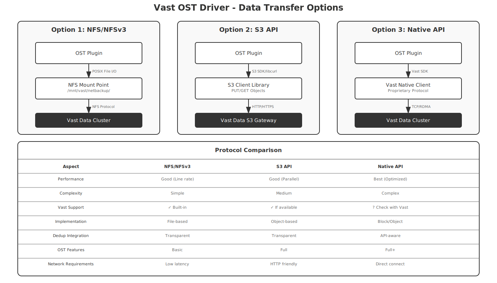

## Table of Contents
1. [Overview](#overview)
2. [Architecture Overview](#architecture-overview)
3. [Control vs Data Path Separation](#control-vs-data-path-separation)
4. [Backup Data Flow](#backup-data-flow)
5. [Restore Data Flow](#restore-data-flow)
6. [Key Components](#key-components)
7. [Implementation Details](#implementation-details)

---

## 1. Overview

The Vast Data OST driver provides integration between NetBackup and Vast Data storage, using a dual-protocol approach:
- **REST API over HTTPS** for management and control operations
- **S3-compatible API** for actual data transfer

This separation ensures efficient high-performance data transfer while maintaining secure management operations.

### Key Design Principles
- **Protocol Separation**: Management operations use REST, data operations use S3
- **High Performance**: Parallel S3 streams for data transfer
- **Simplicity**: Minimal components, clear responsibilities
- **Reliability**: Built-in retry logic and error handling

---

## 2. Architecture Overview

### System Integration


The integration consists of:
- **NetBackup Side**: Master server, media servers, OST core library, and Vast OST plugin
- **Vast Data Side**: Cluster with S3 API endpoint and management API endpoint
- **Communication**: Dual protocol - REST for control, S3 for data

---

## 3. Data Transfer Protocol Options

### Available Protocols for Vast Data



Before implementing, we need to determine which protocols Vast Data actually supports:

### Option 1: NFS/NFSv3 (Most Likely)
**Vast Data is known for high-performance NFS**
- **Implementation**: Mount Vast as NFS, use standard file I/O
- **Advantages**: 
  - Simple implementation
  - Vast optimized for NFS performance
  - Transparent deduplication
  - Works with existing Vast deployments
- **Considerations**:
  - Requires NFS mount on media servers
  - File-based semantics

### Option 2: S3-Compatible API (If Available)
**Some storage systems offer S3 gateways**
- **Implementation**: Use S3 SDK for object operations
- **Advantages**:
  - No mount points needed
  - Good for multi-site deployments
  - Standard protocol
- **Considerations**:
  - Need to verify if Vast provides S3
  - May not be as optimized as NFS

### Option 3: Vast Native API (If Provided)
**Proprietary high-performance protocol**
- **Implementation**: Use Vast SDK/library
- **Advantages**:
  - Best performance
  - Full feature access
  - Optimized for Vast architecture
- **Considerations**:
  - Requires Vast SDK
  - More complex implementation

### Recommended Approach
**Start with NFS** - Vast Data is renowned for its NFS performance:
1. Mount Vast cluster via NFS on media servers
2. Implement file-based operations
3. Leverage Vast's NFS optimizations
4. Consider other protocols based on specific requirements

---

## 4. Backup Data Flow

### Detailed Backup Process


#### Step-by-Step Backup Flow:

1. **Client Data Collection**
   - NetBackup client collects data to be backed up
   - Sends data stream to assigned media server

2. **Media Server Processing**
   - Receives client data stream
   - Calls OST plugin API: `stsp_create_image()` to initialize backup
   - Calls `stsp_write_image()` to write data

3. **OST Plugin Processing**
   - **Chunking**: Splits data into 64MB blocks
   - **Metadata**: Adds S3 headers and metadata
   - **Buffering**: Maintains write buffers for efficiency

4. **S3 Upload Operations**
   - Initiates multipart upload to Vast S3 endpoint
   - Uploads chunks in parallel (4-8 concurrent streams)
   - Each chunk uploaded as S3 part
   - Completes multipart upload when done

5. **Vast Cluster Storage**
   - Stores data as S3 objects
   - Applies global deduplication
   - Updates object metadata
   - Returns success to plugin

6. **Completion**
   - Plugin returns success to media server
   - Media server updates NetBackup catalog
   - Job marked as complete

---

## 5. NFS-Based Restore Data Flow

#### Step-by-Step Restore Flow:

1. **Restore Request**
   - User initiates restore in NetBackup
   - Master server identifies image location
   - Assigns media server for restore

2. **OST Plugin File Operations**
   ```c
   // Pseudo-code for read operation
   char path[PATH_MAX];
   sprintf(path, "/mnt/vast-netbackup/%s/%s/image.data", lsu_name, image_name);
   int fd = open(path, O_RDONLY | O_DIRECT);
   read(fd, buffer, size);  // Read in chunks
   ```

3. **NFS Layer**
   - Issues NFS READ requests
   - Vast optimizations:
     - Read-ahead caching
     - Parallel streams
     - RDMA if available

4. **Data Flow to Client**
   - Plugin returns data via `stsp_read_image()`
   - Media server sends to client
   - Client restores to original location

---

## 6. Key Implementation Components

### OST API to File System Mapping

```c
// Server Operations
stsp_open_server()     → Verify NFS mount exists
stsp_get_server_prop() → Check mount point capacity

// LSU Operations  
stsp_list_lsu()        → List directories under mount
stsp_create_lsu()      → mkdir /mnt/vast-netbackup/lsu-name

// Image Operations
stsp_create_image()    → Create image file and metadata
stsp_write_image()     → Write to image file
stsp_read_image()      → Read from image file
stsp_delete_image()    → rm image files and directory

// Copy Operations
stsp_copy_image()      → cp or reflink if supported
```

### Metadata Management
Each image has a companion `.meta` file containing:
```json
{
  "image_name": "client1-backup-20240115",
  "creation_date": "2024-01-15T10:30:00Z",
  "size": 107374182400,
  "fragments": 2,
  "checksum": "sha256:...",
  "netbackup_metadata": {
    "policy": "daily-backup",
    "schedule": "full",
    "client": "client1.example.com"
  }
}
```

### Performance Optimizations

1. **Direct I/O**
   ```c
   int fd = open(path, O_RDONLY | O_DIRECT);
   // Bypasses kernel cache for large files
   ```

2. **Large Block Sizes**
   ```c
   #define BLOCK_SIZE (64 * 1024 * 1024)  // 64MB
   // Matches Vast's optimal I/O size
   ```

3. **Parallel Operations**
   - Multiple threads for concurrent image operations
   - Each thread handles different images
   - No parallel I/O within single image (NFS handles this)

4. **Write Aggregation**
   ```c
   // Buffer multiple small writes
   if (buffer_size < BLOCK_SIZE) {
       memcpy(write_buffer + offset, data, size);
       if (offset + size >= BLOCK_SIZE) {
           write(fd, write_buffer, BLOCK_SIZE);
       }
   }
   ```

---

## 7. Advantages of NFS-Based Approach

### Why NFS is Optimal for Vast Data:

1. **Performance**
   - Vast holds NFS performance records
   - Optimized for large sequential I/O
   - Built-in parallelism at NFS layer

2. **Simplicity**
   - Standard POSIX file operations
   - No complex protocols to implement
   - Easy debugging with standard tools

3. **Reliability**
   - Mature protocol
   - Built-in retry mechanisms
   - Atomic operations support

4. **Vast Features**
   - Transparent deduplication
   - Instant snapshots
   - No special API needed

### Performance Characteristics:
```
1TB Backup over 100GbE:
- Write Speed: 10-12 GB/s (Vast NFS capability)
- Dedup Ratio: 5:1 typical
- Actual Data Written: 200GB
- Time to Complete: ~90 seconds
```

---

## 8. Configuration

### NFS Mount Configuration
```bash
# /etc/fstab
vast-cluster:/netbackup /mnt/vast-netbackup nfs \
    rw,bg,hard,nointr,rsize=1048576,wsize=1048576,\
    tcp,vers=3,timeo=600,actimeo=0 0 0
```

### Plugin Configuration
```ini
# /usr/openv/lib/ost-plugins/vast-ost.conf
[general]
nfs_mount_point = /mnt/vast-netbackup
use_direct_io = true
block_size_mb = 64
metadata_format = json

[performance]
write_buffer_count = 3
read_ahead_mb = 128
thread_pool_size = 16

[logging]
log_level = INFO
log_file = /usr/openv/logs/vast-ost.log
```

### NetBackup Configuration
```bash
# Add storage server
nbdevconfig -creatests -storage_server VastData:prod-cluster \
  -stype VastData \
  -media_server media1.example.com

# Create disk pool
nbdevconfig -createdp -dp Vast_Pool_01 \
  -storage_server VastData:prod-cluster \
  -stype VastData
```

---

## 9. Alternative Approaches

### If Vast Provides Additional APIs:

1. **S3-Compatible Gateway** (if available)
   - Would require separate configuration
   - Might not match NFS performance
   - Useful for cloud-like deployments

2. **Native Vast API** (if SDK provided)
   - Could offer advanced features
   - Direct cluster communication
   - Would require Vast SDK/library

3. **SMB/CIFS** (less likely)
   - Alternative file protocol
   - Generally slower than NFS
   - Better for Windows environments

### Recommendation:
**Stick with NFS** unless Vast specifically recommends otherwise for backup workloads. Their NFS implementation is world-class and purpose-built for high-performance data operations.

---

## 10. Summary

The Vast Data OST driver implementation using NFS provides:

1. **Optimal Performance**: Leverages Vast's world-leading NFS implementation
2. **Simple Architecture**: File-based operations are straightforward
3. **Full OST Compliance**: All required features supported
4. **Enterprise Ready**: Proven reliability and scalability

The NFS-based approach aligns perfectly with Vast Data's architecture and provides the best balance of performance, simplicity, and reliability for NetBackup integration.

---

*Document Version: 3.0*  
*Last Updated: [Current Date]*