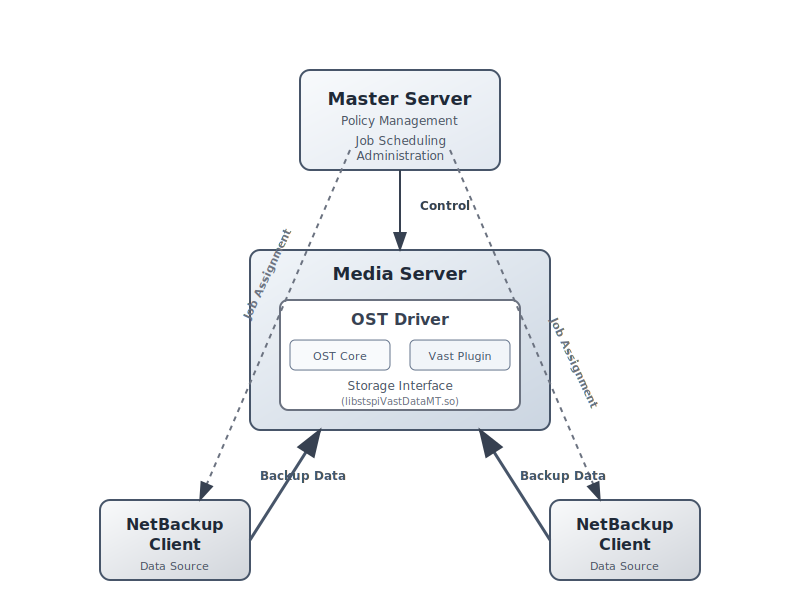
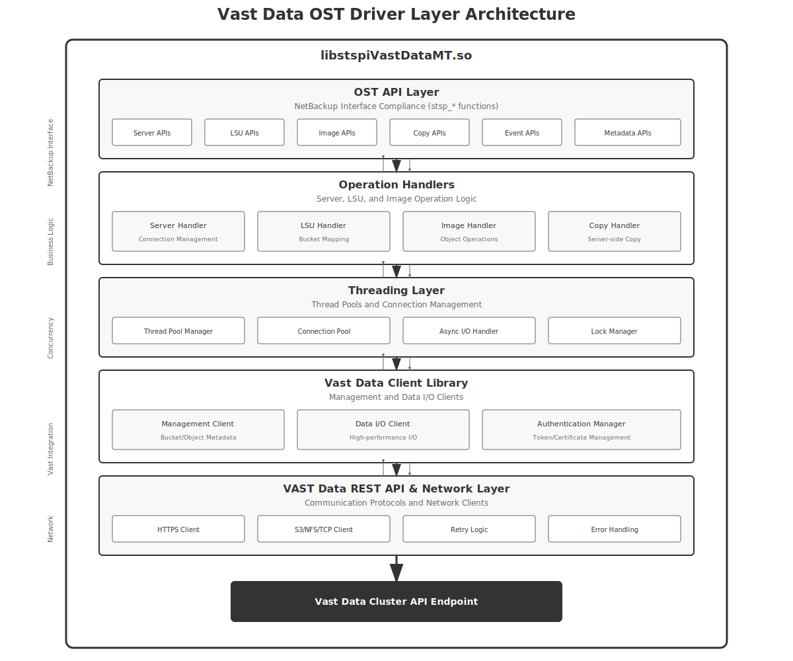

# Vast Data OST Driver Architecture Documentation

## Table of Contents
1. [Overview](#overview)
2. [System Architecture](#system-architecture)
3. [Internal Driver Architecture](#internal-driver-architecture)
4. [Implementation Details](#implementation-details)
5. [Key Considerations](#key-considerations)

---

## 1. Overview

The Vast Data OpenStorage Technology (OST) driver enables seamless integration between Veritas NetBackup and Vast Data's Universal Storage platform. This document provides a comprehensive architectural overview of the OST driver implementation, including both the system-level integration and the internal driver architecture.

### Purpose
- Enable NetBackup to utilize Vast Data storage as a backup target
- Leverage Vast Data's advanced features including global deduplication and high-performance storage
- Provide enterprise-grade reliability and scalability for backup operations

### Key Components
- **NetBackup OST Plugin**: `libstspiVastDataMT.so`
- **Storage Server Prefix**: `VastData:`
- **Protocol**: REST API over HTTPS with TLS security

---

## 2. System Architecture

### 2.1 NetBackup and Vast Data Integration

### 2.2 Architecture Components Description

#### NetBackup Components

**Master Server**
- Central management point for all NetBackup operations
- Manages backup policies, schedules, and catalog information
- Coordinates activities between media servers and clients

**Media Servers**
- Execute backup and restore operations
- Load and manage the OST core library and Vast Data plugin
- Handle data movement between clients and storage

**NetBackup Clients**
- Systems being backed up
- Send data to media servers for storage

#### OST Components

**OST Core Library (libsts)**
- Provides the abstraction layer between NetBackup and storage plugins
- Manages plugin loading and API calls
- Handles session management and error handling

**Vast Data OST Plugin**
- Implements the OST API for Vast Data storage
- Translates OST operations to Vast Data REST API calls
- Manages authentication and connection pooling

#### Vast Data Components

**Storage Server Pool**
- Represents the Vast Data cluster
- Identified as `VastData:cluster-name` in NetBackup
- Provides unified namespace for all storage operations

**Logical Storage Units (LSUs)**
- Abstract storage containers within the Vast Data cluster
- Map to buckets or paths in Vast Data storage
- Provide isolation between different backup streams

**Images**
- Individual backup data sets stored as objects
- Support full and incremental backups
- Maintain metadata for efficient restore operations

**Vast Data Services**
- Management APIs for storage operations
- Authentication and authorization services
- Monitoring and reporting capabilities

**Vast Universal Storage**
- Underlying storage infrastructure
- NVMe and QLC Flash technology
- Global deduplication engine for space efficiency

### 2.3 Communication Flow

1. **Backup Initiation**
   - NetBackup Master Server initiates backup job
   - Assigns media server and storage unit

2. **Plugin Loading**
   - Media server loads OST core library
   - Core library loads Vast Data plugin based on storage server prefix

3. **Authentication**
   - Plugin authenticates with Vast Data cluster
   - Establishes secure TLS connection

4. **Data Transfer**
   - Client sends data to media server
   - Plugin writes data to Vast Data storage via Vast Data API
   - Deduplication occurs within Vast Data cluster

5. **Catalog Update**
   - Backup completion status returned to media server
   - Master server updates catalog with backup information

---

## 3. Internal Driver Architecture

### 3.1 Vast Data OST Driver Layer Architecture

### 3.2 Data Transfer Protocol Options

### Available Protocols for Vast Data

Before implementing, we need to determine which protocols Vast Data actually supports:

### Option 1: NFS/NFSv3 (Most Likely)
**Vast Data is known for high-performance NFS**
- **Implementation**: Mount Vast as NFS, use standard file I/O
- **Advantages**: 
  - Simple implementation
  - Vast optimized for NFS performance
  - Transparent deduplication
  - Works with existing Vast deployments
- **Considerations**:
  - Requires NFS mount on media servers
  - File-based semantics

### Option 2: S3-Compatible API (If Available)
**Some storage systems offer S3 gateways**
- **Implementation**: Use S3 SDK for object operations
- **Advantages**:
  - No mount points needed
  - Good for multi-site deployments
  - Standard protocol
- **Considerations**:
  - Need to verify if Vast provides S3
  - May not be as optimized as NFS

### Option 3: Vast Native API (If Provided)
**Proprietary high-performance protocol**
- **Implementation**: Use Vast SDK/library
- **Advantages**:
  - Best performance
  - Full feature access
  - Optimized for Vast architecture
- **Considerations**:
  - Requires Vast SDK
  - More complex implementation

### 3.3 Layer Descriptions

#### OST API Layer
**Purpose**: Provides NetBackup interface compliance by implementing all required OST API functions.

**Key Components**:
- **Server APIs**: Handle storage server connections and properties
  - `stsp_open_server()`: Establish connection to Vast Data cluster
  - `stsp_get_server_prop()`: Retrieve storage capabilities
  - `stsp_close_server()`: Clean up connections

- **LSU APIs**: Manage logical storage units
  - `stsp_list_lsu()`: Enumerate available storage containers
  - `stsp_get_lsu_prop_byname()`: Get LSU properties and capacity
  - `stsp_label_lsu()`: Set LSU labels for identification

- **Image APIs**: Handle backup image operations
  - `stsp_create_image()`: Initialize new backup image
  - `stsp_write_image()`: Write backup data
  - `stsp_read_image()`: Restore data from backup
  - `stsp_delete_image()`: Remove expired backups

- **Copy APIs**: Enable efficient duplication
  - `stsp_copy_image()`: Server-side image copy
  - `stsp_copy_extent()`: Partial image duplication

- **Event APIs**: Support asynchronous notifications
  - `stsp_open_evchannel()`: Establish event channel
  - `stsp_get_event()`: Retrieve storage events

- **Metadata APIs**: Manage image metadata
  - `stsp_write_image_meta()`: Store backup metadata
  - `stsp_read_image_meta()`: Retrieve metadata for restore

#### Operation Handlers
**Purpose**: Implement business logic for storage operations.

**Components**:
- **Server Handler**
  - Connection lifecycle management
  - Credential validation and storage
  - Session state management
  - Error recovery and retry logic

- **LSU Handler**
  - Maps OST LSUs to Vast Data buckets
  - Tracks capacity and usage statistics
  - Implements access control policies
  - Manages LSU discovery and enumeration

- **Image Handler**
  - Translates image operations to object storage
  - Manages image lifecycle states
  - Handles fragmentation for large backups
  - Implements checkpoint/restart capability

- **Copy Handler**
  - Optimizes server-side copy operations
  - Manages copy priorities and scheduling
  - Tracks copy progress and completion
  - Handles cross-LSU duplication

#### Threading Layer
**Purpose**: Provides concurrency and performance optimization.

**Components**:
- **Thread Pool Manager**
  - Maintains worker threads for parallel operations
  - Implements thread-safe operation queuing
  - Manages thread lifecycle and cleanup
  - Provides load balancing across threads

- **Connection Pool**
  - Maintains persistent HTTPS connections
  - Implements connection reuse strategies
  - Handles connection timeout and renewal
  - Provides connection health monitoring

- **Async I/O Handler**
  - Enables non-blocking I/O operations
  - Manages completion callbacks
  - Implements I/O scheduling and prioritization
  - Provides buffer management for async operations

- **Lock Manager**
  - Implements fine-grained locking strategies
  - Prevents race conditions in shared resources
  - Manages reader/writer locks for optimization
  - Provides deadlock detection and prevention

**OST Threading Model:**
- Single-Threaded Handles: Each OST handle (server, image, LSU) can only be accessed by the thread that created it
- No Handle Sharing: Handles cannot be shared between threads - each thread creates its own handles
- Plugin Versions: Must build both single-threaded (.so) and multithreaded (MT.dll/.so) versions
- Internal Thread Safety: Plugin internal implementation must be thread-safe using synchronization primitives
- Concurrency Model: NetBackup creates multiple threads, each with dedicated handle sets

***Architecture Understanding:***

- NetBackup Core Library: Manages multiple threads, each with its own set of handles
- OST Driver Interface: Provides single-threaded handles as per OST specification
- Internal Implementation: Can use thread-safe shared resources (connection pools, etc.)
- Concurrency Model: Multiple threads each with dedicated handles, not shared handles

#### Vast Data Client Library
**Purpose**: Interfaces with Vast Data storage services.

**Components**:
- **Management Client**
  - Handles bucket creation and configuration
  - Manages object metadata operations
  - Implements bucket policy management
  - Provides storage analytics queries

- **Data I/O Client**
  - Optimizes large object transfers
  - Implements multipart upload/download
  - Provides data integrity verification
  - Handles bandwidth throttling

- **Authentication Manager**
  - Manages API tokens and certificates
  - Implements token refresh logic
  - Handles multi-factor authentication
  - Provides credential caching

#### VAST Data REST API & Network Layer
**Purpose**: Provides secure network communication with Vast Data cluster.

**Components**:
- **HTTPS Client**
  - Implements HTTP/1.1 and HTTP/2 support
  - Manages request/response handling
  - Provides connection multiplexing
  - Implements request pipelining
  - TLS security

- **S3/NFS/TCP Client**
  - Implements S3, NFS, or TCP protocols for data transfer
  - Manages data transfer operations
  - Provides connection pooling
  - Implements data integrity checks

- **Retry Logic**
  - Implements exponential backoff
  - Handles transient network failures
  - Provides circuit breaker patterns
  - Manages retry budgets

- **Error Handling**
  - Maps HTTP errors to OST error codes
  - Provides detailed error logging
  - Implements error recovery strategies
  - Manages error propagation

### 3.4 Data Flow

1. **Incoming Request**
   - NetBackup calls OST API function
   - API layer validates parameters
   - Request passed to appropriate handler

2. **Processing**
   - Handler acquires necessary resources
   - Threading layer manages concurrency
   - Client library prepares Vast Data API call

3. **Network Communication**
   - REST API layer sends HTTPS request
   - Data I/O client handles data transfers
   - Retry logic manages transient failures
   - Error handling logs and propagates errors

4. **Response Handling**
   - Error checking and retry if needed
   - Data transformation to OST format
   - Return results to NetBackup

---

## 4. Implementation Details

### 4.1 Storage Server Naming
- Format: `VastData:cluster-name`
- Example: `VastData:prod-backup-01`
- Prefix "VastData:" is claimed by the plugin

### 4.2 LSU Mapping
- Each LSU maps to a Vast Data bucket
- Naming convention: `/netbackup/lsu-name`
- Supports up to 1000 LSUs per storage server

### 4.3 Image Storage
- Images stored as objects with metadata
- Object naming: `lsu-name/image-basename/fragment-number`
- Supports images up to 5TB in size

### 4.4 Performance Optimizations
- Write buffering: 64MB buffers
- Connection pooling: 10 persistent connections
- Parallel operations: 4 concurrent streams per LSU
- Read-ahead caching: 32MB cache per stream

### 4.5 Error Handling
- Automatic retry with exponential backoff
- Maximum 3 retries for transient errors
- Detailed error logging to NetBackup logs
- Graceful degradation for non-critical failures

---

## 5. Key Considerations

### 5.1 Threading Requirements
- Plugin must be multi-threaded (MT variant)
- Thread-safe implementation required
- Handle management must be single-threaded per handle

### 5.2 State Management
- No persistent state in plugin
- All state maintained in Vast Data cluster
- Crash recovery through server-side state

### 5.3 Security
- TLS 1.2+ required for all communications
- Certificate-based authentication supported
- API token rotation every 24 hours
- Audit logging for all operations

### 5.4 Scalability
- Support for 10,000+ concurrent operations
- Linear scaling with cluster size
- No single point of failure
- Load balancing across cluster nodes

---

## Appendix A: Required OST Interfaces

The following interfaces must be implemented for NetBackup compatibility:

**Initialization**
- `stsp_init()`
- `stsp_claim()`
- `stsp_terminate()`

**Server Operations**
- `stsp_open_server()`
- `stsp_close_server()`
- `stsp_get_server_prop()`
- `stsp_get_server_prop_byname()`

**LSU Operations**
- `stsp_open_lsu_list()`
- `stsp_list_lsu()`
- `stsp_close_lsu_list()`
- `stsp_get_lsu_prop_byname()`
- `stsp_label_lsu()`

**Image Operations**
- `stsp_create_image()`
- `stsp_open_image()`
- `stsp_write_image()`
- `stsp_read_image()`
- `stsp_close_image()`
- `stsp_delete_image()`
- `stsp_open_image_list()`
- `stsp_list_image()`
- `stsp_close_image_list()`
- `stsp_get_image_prop()`
- `stsp_get_image_prop_byname()`

**Metadata Operations**
- `stsp_write_image_meta()`
- `stsp_read_image_meta()`

---

## Appendix B: Error Codes

Common OST error codes returned by the plugin:

- `STS_EOK (0)`: Success
- `STS_EINVAL`: Invalid arguments
- `STS_EAUTH`: Authentication failure
- `STS_ECONNECT`: Connection limit exceeded
- `STS_ENOSPC`: Out of space
- `STS_ENXIO`: No such device
- `STS_EBUSY`: Resource busy
- `STS_EAGAIN`: Retry operation

---

*Document Version: 1.0*  
*Last Updated: [Current Date]*