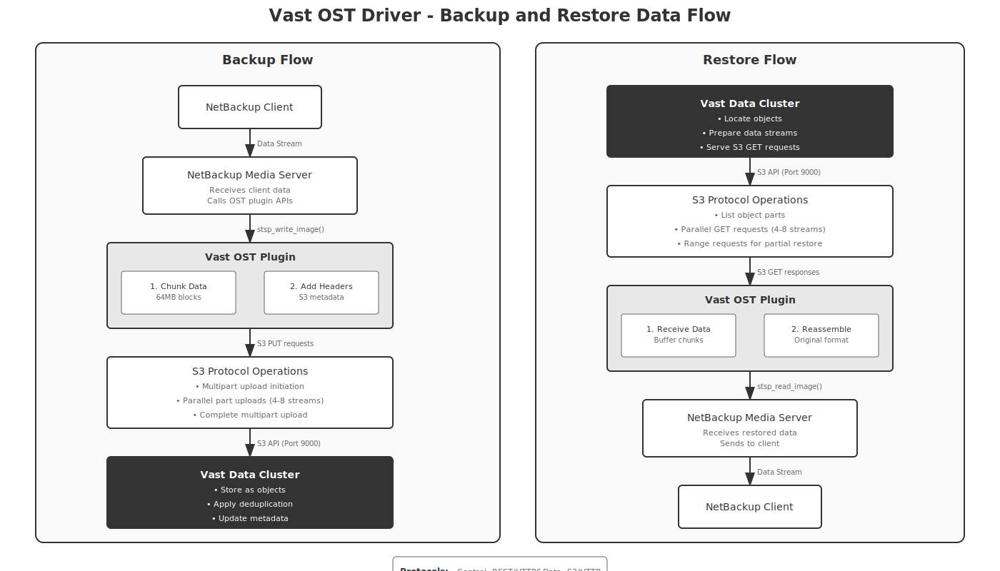

*Document Version: 2.0*  
*Last Updated: [Current Date]*# Vast Data OST Driver Architecture Documentation

## Table of Contents
1. [Overview](#overview)
2. [Architecture Overview](#architecture-overview)
3. [Control vs Data Path Separation](#control-vs-data-path-separation)
4. [Backup Data Flow](#backup-data-flow)
5. [Restore Data Flow](#restore-data-flow)
6. [Key Components](#key-components)
7. [Implementation Details](#implementation-details)
---

## 1. Overview

The Vast Data OST driver provides integration between NetBackup and Vast Data storage, using a dual-protocol approach:
- **REST API over HTTPS** for management and control operations
- **S3-compatible API** for actual data transfer

This separation ensures efficient high-performance data transfer while maintaining secure management operations.

### Key Design Principles
- **Protocol Separation**: Management operations use REST, data operations use S3
- **High Performance**: Parallel S3 streams for data transfer
- **Simplicity**: Minimal components, clear responsibilities
- **Reliability**: Built-in retry logic and error handling

---

## 2. Architecture Overview

### System Integration


The integration consists of:
- **NetBackup Side**: Master server, media servers, OST core library, and Vast OST plugin
- **Vast Data Side**: Cluster with S3 API endpoint and management API endpoint
- **Communication**: Dual protocol - REST for control, S3 for data

---

## 3. Control vs Data Path Separation

### Simplified Driver Architecture


The OST driver is divided into two distinct paths:

### Control Path (Management Operations)
- **Purpose**: Handle all non-data operations
- **Protocol**: REST API over HTTPS (port 443)
- **Operations**:
  - Server connection management
  - LSU (bucket) discovery and management
  - Image catalog operations
  - Authentication and session management
  - Metadata operations

### Data Path (Backup/Restore Operations)
- **Purpose**: Handle actual backup data transfer
- **Protocol**: S3-compatible API (port 9000 or 9443 for HTTPS)
- **Operations**:
  - Image data writes (backups)
  - Image data reads (restores)
  - Server-side copy operations
  - Multipart upload/download

### Common Components
Both paths share:
- **Thread Pool**: 8-16 worker threads for parallel operations
- **Connection Pool**: Persistent connections with keep-alive
- **Error Handler**: Retry logic with exponential backoff

---

## 4. Backup Data Flow

### Detailed Backup Process



#### Step-by-Step Backup Flow:

1. **Client Data Collection**
   - NetBackup client collects data to be backed up
   - Sends data stream to assigned media server

2. **Media Server Processing**
   - Receives client data stream
   - Calls OST plugin API: `stsp_create_image()` to initialize backup
   - Calls `stsp_write_image()` to write data

3. **OST Plugin Processing**
   - **Chunking**: Splits data into 64MB blocks
   - **Metadata**: Adds S3 headers and metadata
   - **Buffering**: Maintains write buffers for efficiency

4. **S3 Upload Operations**
   - Initiates multipart upload to Vast S3 endpoint
   - Uploads chunks in parallel (4-8 concurrent streams)
   - Each chunk uploaded as S3 part
   - Completes multipart upload when done

5. **Vast Cluster Storage**
   - Stores data as S3 objects
   - Applies global deduplication
   - Updates object metadata
   - Returns success to plugin

6. **Completion**
   - Plugin returns success to media server
   - Media server updates NetBackup catalog
   - Job marked as complete

---

## 5. Restore Data Flow

#### Step-by-Step Restore Flow:

1. **Restore Request**
   - User initiates restore in NetBackup
   - Master server assigns media server
   - Media server calls OST plugin

2. **OST Plugin Processing**
   - Calls `stsp_open_image()` to access backup
   - Determines S3 object locations
   - Prepares for data retrieval

3. **S3 Download Operations**
   - Lists object parts from Vast S3
   - Issues parallel GET requests (4-8 streams)
   - Supports range requests for partial restores
   - Downloads chunks to buffers

4. **Data Reassembly**
   - Plugin receives S3 data chunks
   - Reassembles in correct order
   - Removes S3 headers/metadata
   - Returns original data format

5. **Client Restore**
   - Media server receives data from plugin
   - Sends data stream to client
   - Client writes data to original location

---

## 6. Key Components

### OST API Implementation Layer
**Required Interfaces:**
```c
// Initialization
stsp_init()           // Initialize plugin
stsp_claim()          // Claim storage server names starting with "VastData:"
stsp_terminate()      // Cleanup

// Server Operations (REST)
stsp_open_server()    // Connect to Vast cluster
stsp_get_server_prop() // Get capabilities
stsp_close_server()   // Disconnect

// LSU Operations (REST)
stsp_list_lsu()       // List available buckets
stsp_get_lsu_prop_byname() // Get bucket properties

// Image Operations (Mixed)
stsp_create_image()   // Initialize backup (REST)
stsp_write_image()    // Write backup data (S3)
stsp_read_image()     // Read backup data (S3)
stsp_delete_image()   // Delete backup (REST + S3)
```

### Management Operations Handler
- **Authentication**: Manages Vast API tokens
- **Session Management**: Maintains server connections
- **Metadata Operations**: Handles image properties
- **Catalog Updates**: Synchronizes with NetBackup

### Data Operations Handler
- **Chunking Engine**: Splits data into optimal sizes
- **Buffer Management**: Maintains memory buffers
- **Checksum Validation**: Ensures data integrity
- **Compression**: Optional compression before upload

### Vast S3 Client
- **Multipart Upload**: Handles large file uploads
- **Parallel Streams**: 4-8 concurrent connections
- **Retry Logic**: Automatic retry on failures
- **Connection Reuse**: Persistent HTTP connections

### Vast Management Client
- **REST Implementation**: HTTPS communication
- **Token Management**: Handles authentication
- **API Wrappers**: Simplifies Vast API calls

---

## 7. Implementation Details

### Storage Mapping
```
NetBackup Storage Server: VastData:cluster-prod-01
NetBackup LSU: backup-pool-01
Vast Bucket: netbackup/backup-pool-01
Vast Object: netbackup/backup-pool-01/client-name/image-id/fragment-001
```

### Performance Parameters
```
Chunk Size: 64MB (optimal for Vast)
Parallel Streams: 4-8 (configurable)
Buffer Count: 3 per stream
Connection Timeout: 300 seconds
Retry Count: 3 with exponential backoff
```

### S3 Operations
```
Backup:
- PUT /bucket/object?uploadId=xxx (initiate)
- PUT /bucket/object?partNumber=1&uploadId=xxx (upload parts)
- POST /bucket/object?uploadId=xxx (complete)

Restore:
- GET /bucket/object (download)
- GET /bucket/object?range=bytes=0-1048576 (partial restore)

Copy:
- PUT /bucket/dest-object?x-amz-copy-source=/bucket/src-object (server-side copy)
```

### Error Handling
```
Network Errors: Retry with exponential backoff
Authentication Errors: Refresh token and retry
Capacity Errors: Report to NetBackup immediately
Data Errors: Validate checksums, retry if mismatch
```

### Threading Model
```
Main Thread: Handles OST API calls
Worker Threads: 8-16 for parallel I/O
S3 Upload Threads: 1 per parallel stream
S3 Download Threads: 1 per parallel stream
Management Thread: Handles REST API calls
```

### Example Data Flow Sizes
```
1TB Backup:
- Chunks: 16,384 x 64MB
- Parallel Streams: 8
- Estimated Time: ~30 minutes (depends on network)
- Memory Usage: ~1.5GB (buffers)
```

---

## 8. Advantages of This Architecture

### Performance Benefits
- **Parallel I/O**: Multiple S3 streams maximize throughput
- **Direct Data Path**: No proxy servers or data staging
- **Efficient Protocol**: S3 optimized for object storage
- **Native Deduplication**: Leverages Vast's dedup engine

### Operational Benefits
- **Simple Design**: Clear separation of concerns
- **Standard Protocols**: S3 is widely supported
- **Minimal Dependencies**: No proprietary protocols
- **Easy Debugging**: Clear data and control paths

### Reliability Features
- **Automatic Retry**: Built-in retry for transient failures
- **Checksum Validation**: Ensures data integrity
- **Connection Pooling**: Reduces connection overhead
- **Graceful Degradation**: Continues with reduced streams if needed

---

## 9. Configuration Examples

### Storage Server Configuration
```bash
# Add storage server in NetBackup
nbdevconfig -creatests -storage_server VastData:prod-cluster-01 \
  -stype VastData \
  -media_server media1.company.com

# Set credentials
tpconfig -add -storage_server VastData:prod-cluster-01 \
  -stype VastData \
  -sts_user_id apiuser \
  -password 'api-token-here'
```

### Disk Pool Configuration
```bash
# Create disk pool
nbdevconfig -createdp -dp Vast_Pool_01 \
  -storage_server VastData:prod-cluster-01 \
  -stype VastData \
  -dvlist backup-lsu-01
```

### Plugin Configuration File
```ini
# /usr/openv/lib/ost-plugins/vast-ost.conf
[general]
s3_endpoint = https://vast-cluster.company.com:9443
api_endpoint = https://vast-cluster.company.com:443
parallel_streams = 8
chunk_size_mb = 64
connection_timeout = 300
retry_count = 3

[performance]
write_buffer_size = 67108864  # 64MB
read_buffer_size = 67108864   # 64MB
max_connections = 32
keepalive_timeout = 600

[logging]
log_level = INFO
log_file = /usr/openv/logs/vast-ost.log
```

---

## 10. Troubleshooting Guide

### Common Issues and Solutions

**Slow Backup Performance**
- Check parallel streams setting
- Verify network bandwidth
- Monitor Vast cluster load
- Increase chunk size if network latency is low

**Authentication Failures**
- Verify API token is valid
- Check token permissions
- Ensure time sync between servers
- Review firewall rules

**Connection Timeouts**
- Check firewall allows ports 443 and 9443
- Verify Vast endpoints are reachable
- Increase connection timeout
- Check for network MTU issues

**Failed Restores**
- Verify image exists in Vast
- Check S3 bucket permissions
- Validate image metadata
- Review plugin logs for errors

### Debug Commands
```bash
# Test connectivity
curl -k https://vast-cluster:443/api/version
curl -k https://vast-cluster:9443/

# Check plugin logs
tail -f /usr/openv/logs/vast-ost.log

# Verify plugin loaded
/usr/openv/lib/ost-plugins/libstspiVastDataMT.so -version

# Test S3 access
aws s3 ls s3://netbackup/ --endpoint-url https://vast-cluster:9443
```

---

## 11. Best Practices

### Deployment
1. **Network**: Place media servers close to Vast cluster
2. **Sizing**: Use dedicated 10GbE+ network for backups
3. **Security**: Use HTTPS for both control and data
4. **Monitoring**: Set up alerts for failed operations

### Performance Tuning
1. **Parallel Streams**: Start with 8, adjust based on testing
2. **Chunk Size**: 64MB works well for most cases
3. **Buffers**: Allocate 3 buffers per stream
4. **Threads**: Use 2x CPU cores for thread pool

### Maintenance
1. **Updates**: Keep plugin updated with Vast releases
2. **Logs**: Rotate logs daily, keep 30 days
3. **Monitoring**: Track success rates and performance
4. **Testing**: Regular restore tests

---

## 12. Summary

The Vast Data OST driver provides efficient integration between NetBackup and Vast Data storage through:

1. **Dual Protocol Design**: REST for control, S3 for data
2. **High Performance**: Parallel streams and optimal chunking
3. **Simple Architecture**: Clear separation of components
4. **Enterprise Features**: Reliability, security, and monitoring

This architecture ensures maximum performance while maintaining operational simplicity and reliability for enterprise backup operations.
